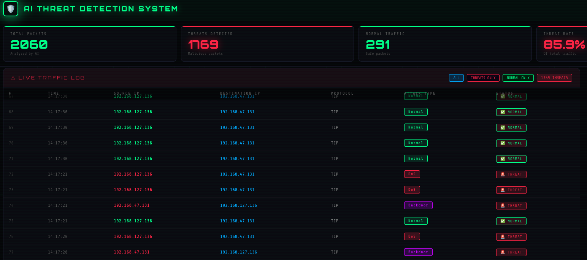

```
 █████╗ ██╗    ████████╗██╗  ██╗██████╗ ███████╗ █████╗ ████████╗
██╔══██╗██║    ╚══██╔══╝██║  ██║██╔══██╗██╔════╝██╔══██╗╚══██╔══╝
███████║██║       ██║   ███████║██████╔╝█████╗  ███████║   ██║   
██╔══██║██║       ██║   ██╔══██║██╔══██╗██╔══╝  ██╔══██║   ██║   
██║  ██║██║       ██║   ██║  ██║██║  ██║███████╗██║  ██║   ██║   
╚═╝  ╚═╝╚═╝       ╚═╝   ╚═╝  ╚═╝╚═╝  ╚═╝╚══════╝╚═╝  ╚═╝   ╚═╝   
                                                                   
██████╗ ███████╗████████╗███████╗ ██████╗████████╗██╗ ██████╗ ███╗  ██╗
██╔══██╗██╔════╝╚══██╔══╝██╔════╝██╔════╝╚══██╔══╝██║██╔═══██╗████╗ ██║
██║  ██║█████╗     ██║   █████╗  ██║        ██║   ██║██║   ██║██╔██╗██║
██║  ██║██╔══╝     ██║   ██╔══╝  ██║        ██║   ██║██║   ██║██║╚████║
██████╔╝███████╗   ██║   ███████╗╚██████╗   ██║   ██║╚██████╔╝██║ ╚███║
╚═════╝ ╚══════╝   ╚═╝   ╚══════╝ ╚═════╝   ╚═╝   ╚═╝ ╚═════╝ ╚═╝  ╚══╝
```

**See every threat. Name every attack. Stop it before it spreads.**

*Real-time packet capture · 9 attack categories · AI ensemble model · Live Flask dashboard*

---

[](https://python.org)
[](https://xgboost.readthedocs.io)
[](https://flask.palletsprojects.com)
[](https://scapy.net)
[](https://kali.org)
[](https://research.unsw.edu.au/projects/unsw-nb15-dataset)
[](https://github.com)
[](LICENSE)

---

## 📱 Overview

**AI Threat Detection** is a real-time network intrusion detection system built on **Kali Linux**. It captures every live network packet using Scapy, extracts 49 network-level features, and classifies traffic into 9 named attack categories using a voting ensemble of XGBoost, LightGBM, and Random Forest — all displayed on a live cyberpunk-styled web dashboard.

> **Built for B.Tech Cyber Security** — tested against real nmap attacks on Metasploitable 2 in a VMware virtual machine lab.

---

## 🎬 Demo


---

## ✨ Features

| Feature | Description |
|---|---|
| 📡 **Live Packet Capture** | Scapy sniffs every IP packet on the network interface in real time |
| 🤖 **AI Ensemble Model** | XGBoost + LightGBM + Random Forest with soft voting — 83% accuracy |
| 🎯 **9 Attack Categories** | Names the exact attack type, not just "threat" or "no threat" |
| 🖥️ **Live Flask Dashboard** | Web UI updates every 2 seconds with threat log and attack breakdown |
| 🔍 **Filter Buttons** | Switch between ALL / THREATS ONLY / NORMAL ONLY views instantly |
| 📊 **Attack Breakdown** | Real-time horizontal bar chart showing proportional attack distribution |
| 🖥️ **System Log Terminal** | Live terminal showing every detection event as it happens |
| ⚡ **Sub-2s Latency** | Packet captured → model prediction → dashboard update in under 2 seconds |
| 🧪 **VM Lab Tested** | Validated against real nmap attacks on Metasploitable 2 via VMware |

---

## 🚨 Attack Types Detected

| Attack | Description |
|---|---|
| **DoS** | Denial of Service — overloading a server to crash it |
| **Exploits** | Attacks exploiting known software vulnerabilities |
| **Reconnaissance** | Port scanning and network probing |
| **Fuzzers** | Random data injection to find weaknesses |
| **Backdoor** | Covert unauthorized remote access channels |
| **Shellcode** | Injection of malicious executable code |
| **Worms** | Self-replicating malware spreading across networks |
| **Analysis** | Spam and HTML-based scanning attacks |
| **Generic** | General cipher-based attacks |

---

## 🗂️ Project Structure

```
threat-detection/
│
├── app.py                              # 🌐 Flask backend — 3 API endpoints
├── realtime.py                         # 📡 Scapy packet capture + AI inference
│
├── notebooks/
│   ├── preprocessing.ipynb             # 🧹 Data cleaning pipeline
│   └── training.ipynb                  # 🤖 Model training + evaluation
│
├── model/
│   ├── threat_model_cat.pkl            # 💾 Trained ensemble model
│   ├── label_encoder.pkl               # 🏷️  Attack category name encoder
│   ├── feature_columns.json            # 📋 49 training feature names
│   └── attack_mapping.json             # 🗺️  Integer class → attack name
│
├── dataset/
│   └── Training and Testing Sets/
│       ├── UNSW_NB15_training-set.csv  # 📊 Training data (175k records)
│       └── UNSW_NB15_testing-set.csv   # 📊 Testing data (82k records)
│
├── templates/
│   └── dashboard.html                  # 🖥️  Live Flask dashboard (HTML/CSS/JS)
│
├── static/                             # 📁 Static assets
├── venv/                               # 🐍 Python virtual environment
├── .gitignore                          # 🚫 Git ignore rules
└── README.md                           # 📖 This file
```

---

## 🧱 Tech Stack

```
OS                  Kali Linux 2024
Language            Python 3.13
ML Models           XGBoost · LightGBM · Random Forest (Scikit-learn)
Packet Capture      Scapy
Web Framework       Flask
Frontend            HTML5 · CSS3 · Vanilla JavaScript (no external libs)
Data Processing     Pandas · NumPy
Development         Jupyter Notebook
Virtualization      VMware Workstation
Dataset             UNSW-NB15 (University of New South Wales, Australia)
Attack Testing      nmap · ping (on Metasploitable 2)
```

---

## 📊 Model Performance

```
Training Dataset     UNSW-NB15 (2.5 million records · 49 features)
Balancing Strategy   Undersampling to 1,500 samples per class
Train / Test Split   80% / 20%  (random_state = 42)
Ensemble Strategy    Soft voting (averaged probabilities)
```

| Attack Type | Precision | Recall | F1-Score | Support |
|---|---|---|---|---|
| Normal | 0.92 | 0.95 | **0.94** | 18,613 |
| Generic | 1.00 | 0.98 | **0.99** | 11,537 |
| Exploits | 0.63 | 0.88 | **0.73** | 9,080 |
| Fuzzers | 0.72 | 0.62 | **0.66** | 4,831 |
| Reconnaissance | 0.92 | 0.75 | **0.83** | 2,852 |
| DoS | 0.38 | 0.16 | **0.22** | 3,292 |
| Shellcode | 0.68 | 0.67 | **0.67** | 309 |
| **Overall Accuracy** | — | — | **0.83** | 51,535 |

---

## ⚙️ Installation

### Prerequisites

```
Kali Linux (recommended) or Ubuntu
Python 3.8+
VMware Workstation
Metasploitable 2 VM (for attack testing)
```

### Step 1 — Clone

```bash
git clone https://github.com/YOUR_USERNAME/ai-threat-detection.git
cd ai-threat-detection
```

### Step 2 — Virtual Environment

```bash
python3 -m venv venv
source venv/bin/activate
```

### Step 3 — Install Dependencies

```bash
pip install pandas numpy scikit-learn matplotlib seaborn jupyter \
            xgboost lightgbm flask flask-socketio scapy requests
```

### Step 4 — Download Dataset

Download **UNSW-NB15** from:
> https://research.unsw.edu.au/projects/unsw-nb15-dataset

Place inside:
```
dataset/Training and Testing Sets/
```

### Step 5 — Preprocess + Train

Open Jupyter and run the notebooks in order:

```bash
jupyter notebook
```

1. `notebooks/preprocessing.ipynb` → creates `dataset/cleaned_data.csv`
2. `notebooks/training.ipynb` → saves model files to `model/`

---

## ▶️ Running the System

Open **3 terminals simultaneously:**

### Terminal 1 — Flask Dashboard

```bash
source venv/bin/activate
python3 app.py
```

Open browser → **http://127.0.0.1:5000**

### Terminal 2 — Real-Time Detection

```bash
source venv/bin/activate
sudo venv/bin/python3 realtime.py
```

### Terminal 3 — Attack Simulation

```bash
# SYN Stealth Scan → Reconnaissance
nmap -sS 192.168.47.131

# Aggressive Scan → Exploits + Recon
nmap -A -T4 192.168.47.131

# Full Port Scan → high volume
nmap -p- 192.168.47.131

# Vulnerability Scan → Exploits
nmap --script vuln 192.168.47.131

# Ping Flood → DoS
sudo ping -f 192.168.47.131

# FTP Brute Force → Backdoor
nmap --script ftp-brute -p 21 192.168.47.131
```

---

## 🔬 Virtual Machine Lab

| Property | Kali Linux | Metasploitable 2 |
|---|---|---|
| **Role** | Detection Host + Attacker | Vulnerable Target |
| **IP** | 192.168.47.130 | 192.168.47.131 |
| **OS** | Kali Linux 2024 | Ubuntu 8.04 |
| **Network** | VMware NAT | VMware NAT (same subnet) |
| **Tools** | Scapy · Flask · nmap | FTP · SSH · SMB · HTTP |

---

## 📡 API Reference

| Endpoint | Method | Description |
|---|---|---|
| `/` | GET | Serves the live dashboard HTML |
| `/add_packet` | POST | Receives detection result from realtime.py |
| `/status` | GET | Returns all packets + stats as JSON |
| `/blocked` | GET | Returns list of blocked IPs (if enabled) |

### Sample `/status` Response

```json
{
  "total": 1201,
  "threats": 1059,
  "normal": 142,
  "threat_rate": 88.2,
  "all_packets": [
    {
      "time": "14:09:40",
      "src_ip": "192.168.47.131",
      "dst_ip": "192.168.127.136",
      "proto": "TCP",
      "status": "THREAT",
      "attack_type": "Backdoor"
    }
  ]
}
```

---

## 🗺️ Roadmap

- [x] Real-time Scapy packet capture on Kali Linux
- [x] 9-class AI ensemble model (XGBoost + LightGBM + RF)
- [x] Live Flask web dashboard
- [x] Filter buttons — ALL / THREATS ONLY / NORMAL ONLY
- [x] Attack breakdown panel with real-time bars
- [x] VM lab testing with Metasploitable 2
- [ ] LSTM deep learning for sequential traffic analysis
- [ ] Automatic IP blocking via iptables
- [ ] Full flow-level feature extraction (nfstream)
- [ ] Email / SMS / push notification alerts
- [ ] Docker containerization
- [ ] Cloud deployment (AWS / Azure)
- [ ] SIEM integration (Splunk / Elastic)
- [ ] Historical data storage (SQLite)

---

## 🤝 Contributing

```bash
# Fork → Clone → Branch
git checkout -b feature/your-feature-name

# Make changes, then commit
git commit -m "feat: your feature description"

# Push and open Pull Request
git push origin feature/your-feature-name
```

---

## ⚠️ Disclaimer

This project is developed strictly for **academic and educational purposes**. All testing was conducted in an **isolated VMware virtual machine lab** using owned hardware.

> Deploying packet capture or network monitoring tools on any system or network without **explicit written authorization** is illegal under applicable laws including the Information Technology Act and equivalent legislation.

The developer assumes **no liability for misuse**.

---

## 📚 References

- Moustafa, N., & Slay, J. (2015). UNSW-NB15. MilCIS, IEEE.
- Chen, T., & Guestrin, C. (2016). XGBoost. ACM KDD.
- Ke, G., et al. (2017). LightGBM. NIPS.
- Breiman, L. (2001). Random Forests. Machine Learning, 45(1).
- Scapy: https://scapy.net
- Flask: https://flask.palletsprojects.com

---

## 👤 Author

**Dipika Gurjar**

B.Tech Cyber Security · Unitedworld Institute of Technology, Karnavati University · 2025–26

---

<div align="center">

**AI Threat Detection** — *built on Kali Linux · v1.0.0*

*Detection is not a feature. It is a necessity.*

⭐ Star this repo if you found it useful!

</div>
